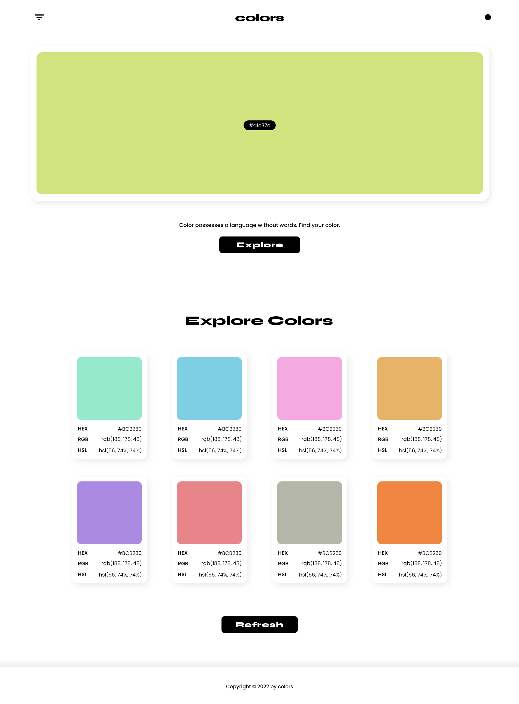

# Colors

> Colors is a random color generator, powered by the [xColors API](https://x-colors.herokuapp.com) by [cheatsnake](https://github.com/cheatsnake).

(More in-depth description)

## Features

tbd (features, code snippets, gifs, etc)

## API

tbd (copy relevant parts from API readme? w/ credit)

## Usage

tbd (how to run it locally)

## Credits

+ [Colors](https://github.com/superlunch/color-search) web app by [Scout Cox](https://github.com/superlunch) & [Yingyang Zhang](https://github.com/#) @ Flatiron School

+ [xColors API](https://x-colors.herokuapp.com) by [cheatsnake](https://github.com/cheatsnake)
