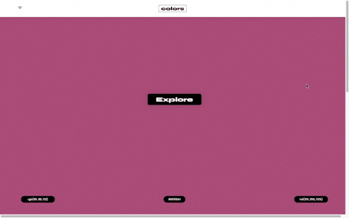
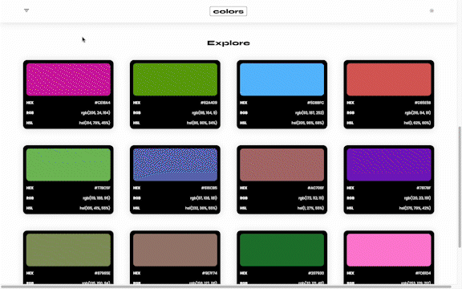

# Colors

> Colors is a random color generator, powered by the [xColors API](https://x-colors.herokuapp.com) by [cheatsnake](https://github.com/cheatsnake).

 

 

## Features
 
The landing page features a random color and its RGB, HEX & HSL codes. When the home color is clicked, a new random color is generated in its place.

 
 

 

The “Explore” button scrolls users down to a number of random color cards with their HEX, RGB and HSL codes. When moused over, cards will hover. 

 

 

Clicking the “Refresh” button below these cards will repopulate the color cards with a new collection of random colors.

 

 

Via a collapsible sidebar menu, users will have the option to filter random color cards by hue.

 

 

Users can also toggle between light & dark color card backgrounds by clicking a button in the upper righthand corner of the application, visible only upon scrolling down to the "Explore" section.

 

 

## Credits

+ [Colors](https://github.com/superlunch/color-search) web app by [Scout Cox](https://github.com/superlunch) and [Yingyang Zhang](https://github.com/#) @ Flatiron School, 2022

+ [xColors API](https://x-colors.herokuapp.com) by [cheatsnake](https://github.com/cheatsnake)

 